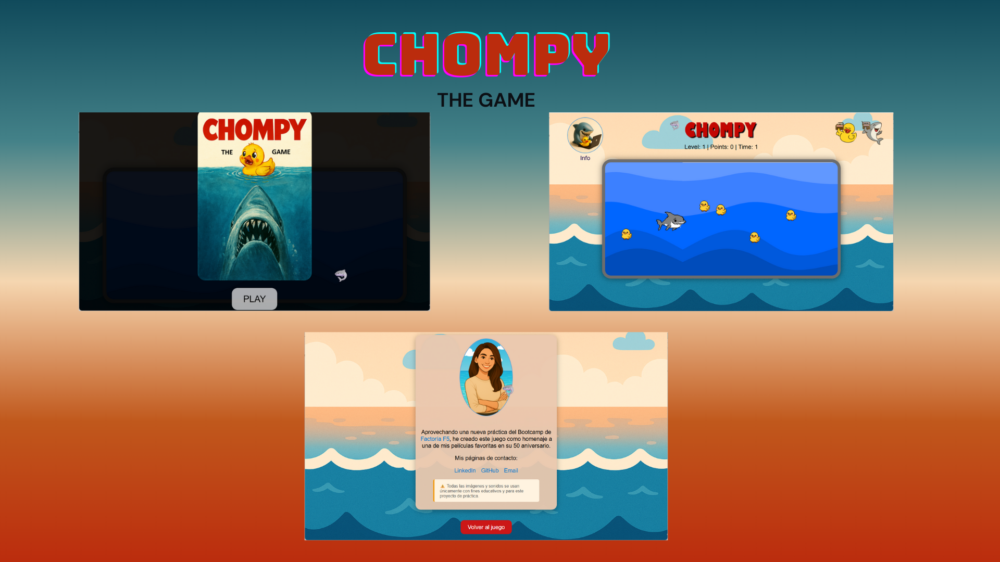

  

¡Bienvenid@ a **Yuki - The Game**!  
Un minijuego creado a partir de [Chompy-The Game](https://github.com/Aday25/chompy-the-game), para integrarlo como extra en nuestro proyecto Fullstack en equipo, **El Gran Azul**, desarrollado durante el bootcamp 🎬✨.  

En esta versión, nuestro protagonista es **Yuki**, una foca polar de Groenlandia 🦭❄️, y el objetivo ahora es comerse bacalaos 🐟 en lugar de patitos, ¡con un toque educativo sobre la contaminación marina!  

---

## 📖 Descripción del proyecto
Este juego ha sido desarrollado como práctica de **Programación Orientada a Objetos (POO) en JavaScript**, con el objetivo de reforzar conceptos clave de clases, herencia y manipulación del DOM de forma divertida.  

En él controlarás a **Yuki**, la foca glotona que debe comerse todos los bacalaos mientras evita los objetos contaminantes (botellas de plástico, latas, etc.) que flotan en el océano 🌊♻️. La idea es **jugar y concienciar al mismo tiempo**.  

---

## 🎮 Gameplay

  

### 🤳 Controles ◀️​▶️​🔼​🔽​
- ⌨️ **PC**: Usa las flechas del teclado para mover a Yuki.  
- 📱 **Móvil**: Controles táctiles adaptados para una mejor experiencia.  

---

## 🐟​Personajes🐾

- **Yuki** 🐾: Nuestra foca protagonista, curiosa y glotona, víctima de la contaminación en los océanos.
- **Bacalaos** 🐟: El alimento de Yuki, inspirado en su dieta real en Groenlandia.  
- **Basura marina** 🥤🥫: Botellas, latas y otros elementos que hay que evitar para mantener los océanos limpios.  

---

## 📂 Estructura del proyecto
El proyecto contiene varias carpetas y archivos principales:  

- `index.html` → Página principal del juego  
- `style.css` → Estilos visuales (con diseño responsive y cursor personalizado)  
- `script.js` → Lógica del juego en JavaScript (POO)  
- `assets/` → Carpeta con imágenes y sonidos usados
  
---

## ✨ Características

- ✅ Diseño responsive adaptado a diferentes dispositivos  
- ✅ Animaciones de agua y movimiento de bacalaos  
- ✅ Cursor personalizado con emoji 🦭 
- ✅ Pantalla inicial con **cover screen** y botón Play  
- ✅ Controles de música y sonidos ambientales  
- ✅ Elementos educativos sobre contaminación marina  

---

## 🙌 Créditos y agradecimientos
Este proyecto se inspira en [Chompy-The Game](https://github.com/Aday25/chompy-the-game) y en las enseñanzas de mi profesora [Ana Aragón](https://github.com/anaaragon88/oop-game) 🥰.  
Hemos adaptado y modificado la dinámica, los personajes y el diseño general para crear **Yuki - The Game**, con un toque educativo y de concienciación ambiental.  

> “Yuki - The Game” es una adaptación de una idea inical a los nuevos proyectos que vamos realizando 💻❄️  

---

## 📌 Notas importantes
⚠️ **Todas las imágenes y sonidos se usan únicamente con fines educativos y para este proyecto de práctica.**  

---

## 👾 Sobre este proyecto
Este juego forma parte de una práctica dentro del **Bootcamp de [Factoría F5](https://factoriaf5.org/)** y se quiere integrar como extra en nuestro proyecto Fullstack **El Gran Azul**, desarrollado en equipo.  

Puedes explorar ambos repositorios:  
- [Chompy-The Game](https://github.com/Aday25/chompy-the-game) → El juego original que inspiró a Yuki  
- [El Gran Azul](https://github.com/Grupo5-Biologia-Marina) → Proyecto Fullstack completo con integración del juego  

---

### 🌐 Contácta conmigo:
- [LinkedIn](https://www.linkedin.com/in/adayasc/)  
- [Email](mailto:aday.it25@gmail.com)  

---

  

