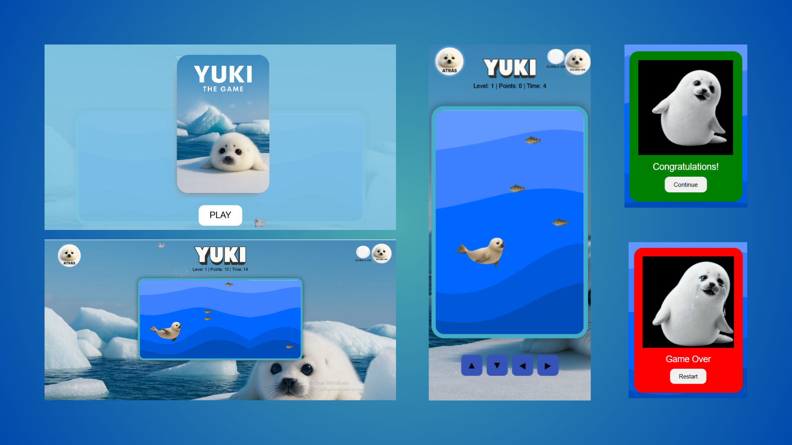

  

¡Bienvenid@ a **Chompy - The Game**!  
Un minijuego creado como homenaje a una de mis películas favoritas en su 50º aniversario junto con los  🎬✨.  
Chompy, el tiburón, también acompaña todos mis proyectos como mi **cibermascota y logo personal** 👩🏻‍💻​❤️🦈.  

---

## 📖 Descripción del proyecto
Este juego ha sido desarrollado como práctica de **Programación Orientada a Objetos (POO) en JavaScript**, con el objetivo de reforzar conceptos clave de clases, herencia y manipulación del DOM de forma divertida.  

En él controlarás a **Chompy**, un tiburón glotón que debe comerse todos los patitos 🐥 que flotan en el océano.  

---

## 🎮 Gameplay

  

### 🎯 Controles ◀️​▶️​🔼​🔽​
- ⌨️ **PC**: Usa las flechas del teclado para mover a Chompy.  
- 📱 **Móvil**: Controles táctiles adaptados para una mejor experiencia.  

---

## 🐥​​Personajes🦈

- **Chompy** 🦈: Nuestro tiburón protagonista , glotón pero adorable, que simboliza la energía y curiosidad de los programadores enfrentándose a nuevos retos.  
- **Patitos de goma** 🐥: Inspirados en los patitos que acompañan a muchos desarrolladores mientras programan.

---

## 📂 Estructura del proyecto
El proyecto contiene varias carpetas y archivos principales:  

- `index.html` → Página principal del juego  
- `style.css` → Estilos visuales (con diseño responsive y cursor personalizado)  
- `script.js` → Lógica del juego en JavaScript (POO)  
- `assets/` → Carpeta con imágenes y sonidos usados  
- `about-me/` → Sección personal con información extra sobre mí y mis proyectos  

---

## ✨ Características

- ✅ Diseño responsive adaptado a diferentes dispositivos
- ✅ Gif del Tiburón creado y animado por mí
- ✅ Animaciones (agua en movimiento, patitos flotando)
- ✅ Cursor personalizado con emoji 🦈
- ✅ Pantalla inicial con **cover screen** y botón Play
- ✅ Botones de control extra: música 🎵 y "cuack" patitos 🐥
- ✅ Apartado **About Me** integrado en el proyecto

---

## 🙌 Créditos y agradecimientos
Este proyecto se inspira en el esqueleto inicial propuesto por mi profesora [Ana Aragón](https://github.com/anaaragon88/oop-game), y después de su maravillosa clase.🥰  
He adaptado y modificado la dinámica, los controles y el diseño general para convertirlo en mi propia versión personalizada.  

> “Chompy - The Game” es mi pequeña contribución creativa, desarrollada con cariño, dedicación y mucha ilusión 💻🥹

---

## 📌 Notas importantes
⚠️ **Todas las imágenes y sonidos se usan únicamente con fines educativos y para este proyecto de práctica.**  

---

## 🚀 Sobre este proyecto
Este juego forma parte de una práctica dentro del **Bootcamp de [Factoría F5](https://factoriaf5.org/)**.  

### 🌐 Mis contactos
- [LinkedIn](https://www.linkedin.com/in/adayasc/)  
- [GitHub](https://github.com/Aday25)  
- [Email](mailto:aday.it25@gmail.com)  

---

  

